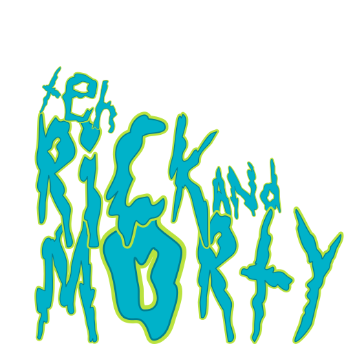

# The Rick and Morty

The Rick and Morty is an open-source website that allows users to browse and search for different characters from the Rick and Morty series. This project is built using Vite and React, and it leverages the Rick and Morty API to fetch character data.

## Features

- Browse through a list of Rick and Morty characters
- Apply filters to search for specific characters
- View detailed information about each character

## Getting Started

These instructions will help you set up the project on your local machine for development and testing purposes.

### Prerequisites

- Node.js (version 14 or higher)
- npm (version 6 or higher) or yarn

### Installation

1. Clone the repository:
	```sh
	git clone https://github.com/yourusername/the-rick-and-morty.git
	cd the-rick-and-morty
	```

2. Install the dependencies:
	```sh
	npm install
	# or
	yarn install
	```

## Usage

Once the development server is running, you can access the application at `http://localhost:3000`. Use the search bar to find your favorite character and explore their profiles.

## Contributing

We welcome contributions from the community! If you'd like to contribute, please follow these steps:

1. **Fork the repository**.
2. **Create a new branch**:
    ```bash
    git checkout -b feature/your-feature-name
    ```
3. **Make your changes**.
4. **Commit your changes**:
    ```bash
    git commit -m "Add your commit message"
    ```
5. **Push to the branch**:
    ```bash
    git push origin feature/your-feature-name
    ```
6. **Create a Pull Request**.

## License

This project is licensed under the MIT License. See the LICENSE file for more details.


Happy coding! If you have any questions or need further assistance, feel free to reach out.